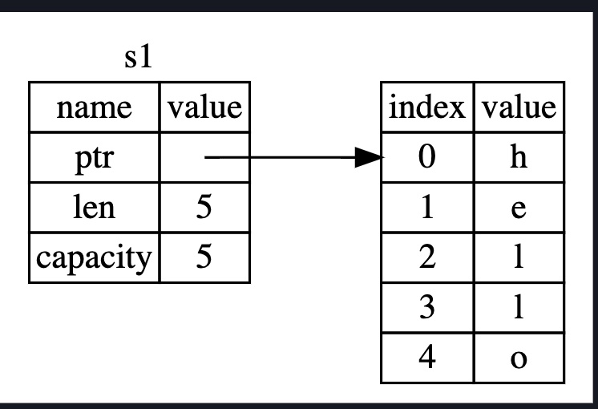
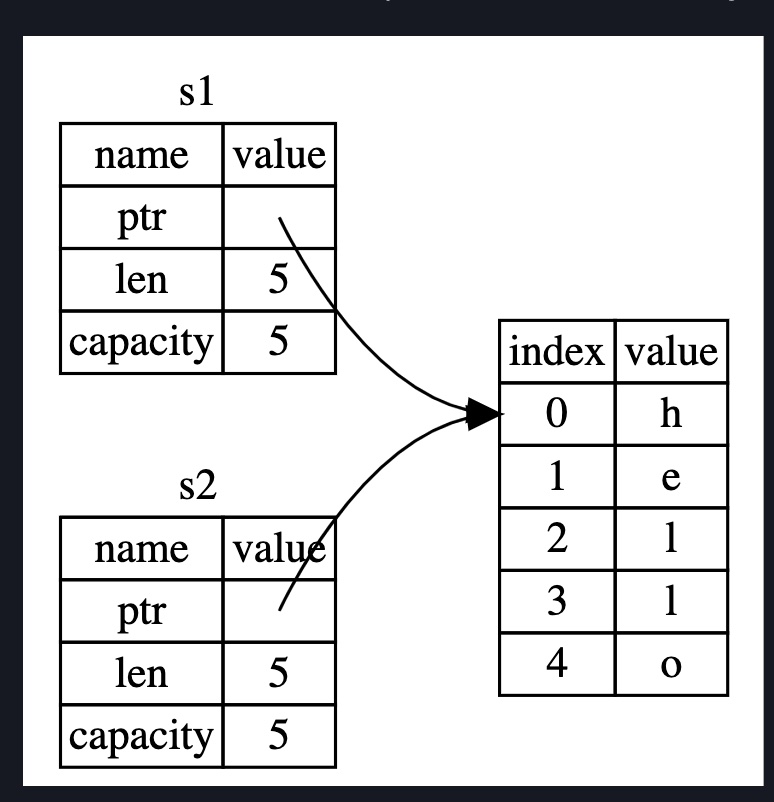

## Ownership

- Set of rules that govern how Rust program manages memory
- programs need to manage how they use computer memory -> some have garbage collectors that track no longer used memory, others expect programmer to allocate and free memory
- Rust uses ownership approach -> memoery is managed with a system of ownership with a set of rules the compiler checks
- ownership featrues will not slow down a program while its running

---

### Stack and Heap
_Stack_
- Stack and heap are parts of memory available for your program to use during runtime
- Both handle memory storage differently
- Stack stores values in the order it gets them and removes in opposite order(last in, first out LIFO)
- Best example is a stack of plates ordered by a waiter, one on top of other -> the last received plate is placed on top of the stack. And if the waiter has to remove a plate, he will remove the last one again from the top
- Adding data is called `pushing` to the stack -> removing data is called `popping` off the stack
- **All data stored on stack must have fixed and known size - unknown size at compile time or size that can change does NOT go into stack but the heap**

_Heap_
- Heap is less organized -> when you put data onto heap, you request a certain amount of space
- Memory allocator finds an empty slot in the memory that is large enough, marks it as being in use, and returns a pointer to that slot, which is the address of the location where data is stored
- this process is called "allocating" on the heap
- beacuse pointer to heap is known and fixed size, this pointer can be stored on stack
- Example here is a restaurant table -> when you reach a hotel, host finds you a spot based on the number of people expected. When some people turn up late, they can simply ask the host the table location to connect with the rest of the group
- In this analogy, if it was a heap, there was no need for a host as the group would have picked the empty seats and got themselves seated there (which never happens)


_Comparisons_
- Pushing to stack is faster than allocating to the heap
- In former, there is no need to search, while in latter, allocator needs to search for location to store new data
- for stack, location is always top of the stack
- in heap, allocator has to find big enough space and keep an accounting entry of which slot is occupied and its location

- Similarly, accessing data from heap is slower from that of stack
- If heap requires processing data across different locations, it becomes slowers because there is a lot of jumping around in memory
- Analogy here is of a server who keeps jumping tables to take orders -> so order 1 in table1 and order 2 in table 2 and back to order 3 in table 1 and so on - there is a lot of bookkeeping and back-and-forth here that slows a waiter down. Instead it is much easier to take all orders from table 1 and then move to table 2 -> that is what a stack kind of does
- much faster to handle memory on stack because it is all at one place
- When code calls a function -> including the pointers to the heap and function's local variables are pushed to the stack. When function execution is complete, these values get popped off the stack

---

### Challenges of memory management
- Programs face the following issues, specially related to memory on the heap
	- keeping track of what parts of code are using what data on the heap
	- avoiding storage clashes where 2 different parts of code access the same memory location
	- minimizing amount of duplicate data on heap
	- cleaning out no-longer used data so that we don't run up with out-of-memory issues

- Ownership in that sense is defining rules around memory management, specially the way things are organized, accessed and deleted in the heap
- Understanding ownership allows one to stop thinking actively about memory management because ownership rules are taking care of it

---

###Ownership rules

Here are some of ownership rules

- Each value in rust has an owner
- There can only be one owner at a time
- When owner goes out of scope, value is dropped

Scope here refers to the range within a program for which item is valid.

Consider the variable declared below:

```
    {                      // s is not valid here, it’s not yet declared
        let s = "hello";   // s is valid from this point forward

        // do stuff with s
    }                      // this scope is now over, and s is no longer valid

```

Note that this variable has a limited scope, from the point it was defined to the time the `}` appears where the scope actively ends. 

### String Type

- Simple data types whicha are fixed size are managed on the stack -> they reside on the stack and can be easily copied into local variables when needed. Memory management here is not that challenging
- To really understand the way Rust manages heap, we need a more dynamic type that cannot be stored on stack. Hence we consider the string type where data is stored on the heap
- String size need not be known upfront and something the can change in runtime. To handle this we have `String` type. String can be obtained from string literal as follows

```
 let mut s = String::from("hello");
``` 
- Note that the variable is mutable and can be modified after declaration as follows:

```
  s.push_str("_world");
  print("{}", s);
```

- unlike string literals, note above that String type can be mutated, lets see why
- in string literal, the size is known at compile time, and it is immutable -> hence they are directly hardcoded into final executable. This makes accessing and working with them super fast
- this flexibility comes from the immutability of string literal

- we cannot insert a blob of memory into the binary knowing well that the value and size can change on runtime
- In order to support mutable, growable piece of text, we have to allot memory in heap that is unknown at compile time and  can change in runtime
- This poses 2 challenges
	- we need to request memory from allocator at runtime
	- once used, we need to return the memory back to allocator for reuse
- first part above is done by programmer when we call `String::from()` as shown above - this part is always handled by the programmer
- if language supports garbage collector (GC), GC will do the job of identifying which variables are no longer used and free up memory
- with no GC, we will have to actively manage memory and free it up as the need be
- Rust takes a different approach  -> memory is automatically returned once the variable that owns this memory goes out of scope
- When the variable goes out of scope, Rust calls a special function `drop` to return memory - it gets automatically triggered when `}` is processed


### Memory Allocation

- Consider an example below -> in this case, the vriable y copies the value in x. New memory is allotted - this is easy because integers have fixed size and so, fastest way is to copy value in x and bind it to y and keep y on the stack (and not the heap)

```
let x = 5;
let y = x;
```

- Now, lets look at another example. In this case, unlike the fixed scenario, the value is NOT copied and assigned to s2. Instead the pointer to the value gets copied to s2

```
let mut s1 = String::from("hello there");
let s2 = s1;

```

- To understand better, look at the following figure




- A String is made of 3 parts -> a pointer to memory, length and capacity. length refers to the length in bytes of memory the String is currently using. capacity refers to the total length in bytes of memory the String has received from allocator. 

	- Actual memory is contained elsewhere and the pointer is kind of a map that leads us to the memory storage

	- Note that this data, ie. the pointer/length and capacity that define a String type are stored on Stack because all of them are fixed size


	- Going back to the example above, what is actually happening is that the pointer to memory of s1 is copied and bounded to the pointer of s2. Actual contents of memory are untouched -> and its only the pointer that is being updated




- It is important to note that memory storage is not duplicated -> had this been the case, assigning a string variable would have become a very expensive operation

- but this poses a challenge -> how do we ensure that two different variables don't write to the same memory simultaneously -> and here is where Rust's rule of "out of scope deletion" comes into play


- But if s1 and s2 both go out of scope, both will trigger `drop`function and try to clear the same memory twice. This can lead to memory corruption and has to be avoided

- The way this is avoided by Rust by considering previous variable invalid as soon as it is assigned to another variable -> this way, at any given time, only one variable has the possibility to trigger the `drop` at any time. Chance of memory corruption doesn't exist in this design

- However, this means that the compiler throws an error when we try to access a variable that no longer exists


```
     fn test_strings(){
	
	let s1 = String::from("hellow world"); //assigns memory in heap and gives pointer to s1
	let s2 = s1; //Now the pointer is passed to s2 and s1 no longer can be accessed

	println!("s1 string {}", s1); // this throws a compile error
    }


```

- We call the previous example as "s1 is moved to s2". In other languages, its called "shallow copy" as only pointer is copied. In Rust though, since the other variable cannot be accessed anymore, its called "moving" from s1 to s2.


- Rust never creates "deep" copying when copying heap data. So, we can safely assume that any kind of copying is inexpensive at run-time


- If we do want a deep copy, we can use a method called `clone`

```
fn test_string_deep_copy(){
    let s1 = String::from("hello there");

    let s2 = s1.clone();

    println!("Value of s2 {}", s2);
    println!("Value of s1 {}", s1);// since we did a deep clone this should work
}

```

- Passing a variable into a function has a similar behavior as moving a variable from one to another. As soon as a variable is passed into function, original variable is invalidated and ceases to exist (`drop` gets triggered). If we want to have the variable again inside the caller scope, we have no option but to return the variable from callee function

```
fn main() {
    let s = String::from("hello");  // s comes into scope

    takes_ownership(s);             // s's value moves into the function...
                                    // ... and so is no longer valid here

    let x = 5;                      // x comes into scope

    makes_copy(x);                  // x would move into the function,
                                    // but i32 is Copy, so it's okay to still
                                    // use x afterward

} // Here, x goes out of scope, then s. But because s's value was moved, nothing
  // special happens.


fn takes_ownership(some_string: String) { // some_string comes into scope
    println!("{}", some_string);
} // Here, some_string goes out of scope and `drop` is called. The backing
  // memory is freed.

fn makes_copy(some_integer: i32) { // some_integer comes into scope
    println!("{}", some_integer);
} /

```

- In the example above -> note that `some_string` loses all existence once `take_ownership` function is executed. And the parent function, `s` goes out of scope once it passes the variable into `take_ownership` -> here, we have completely lost the string value stored in heap, because it got erased from memory. However, we can access the value of `x` even after `make_copy` is called because x is duplicated and sent to the function.  


  

- Note above that taking ownership of a variable in a function and giving it back again to the caller scope is a tedious job -> this involves unnecessary passing around of variables and can create needlesly long function signatures

- What if we want to use the value of the variable but do not want to use it -> this is where passing as a reference comes into play. We use the `&` sign to denote that a variable is being passed as a reference and not as value


### References and Borrowing

- In previous example, we had to return string in tuple only because that string was moved into the function -> as we have seen, this increases the signature of function
 
- What if we want to use the value of the variable but do not want to use it -> this is where passing as a reference comes into play. We use the `&` sign to denote that a variable is being passed as a reference and not as value

```
fn main() {
    let s1 = String::from("hello");

    let len = calculate_length(&s1);

    println!("The length of '{}' is {}.", s1, len);
}

fn calculate_length(s: &String) -> usize {
    s.len()
}
```
- In above function we passed string as reference and even after function execution, we could print out the string value -> this is because we did not move the variable to the function, simply passed a reference pointer that points to the memory location


- Note that we made two changes, one is we passed `&s1` into the `calculate_length` function, next we changed the signature of function to accept string `s` as `&String` and not `String`. This tells the function that it only has a pointer to location and hence cannot make any changes or updates to the memory -> ie. function has permission only to read the memory


- Opposite of referencing is `dereferencing`. For dereferencing a variable, we use `*` instead of `&`. We will learn later the use cases for this..


- In this case, the function `calculate_length` has borrowed the variable s and does not own that variable -> therefore, when the context ends, there is nothing for compiler to drop - you cannot drop something that you do not own in the first place

- Another obvious advantage is because we are only borrowing a variable from the caller scope, we don't have to return back that variable to the original scope. A borrowed value does not have ownertship by definition


- Note the following function throws an error. Even though variable is borrowed in the `append_string` function, this function is trying to change the memory value in the heap. This function curretly only has the right to read from memory and not write to it. This is because the variable is passed on as a reference and within the context of the callee function, this variable is immutable.


```
fn main(){
   let s = String.from("Hello);

   append_string(&s);
}

fn append_string(s: &String){
 
  let s2 = s.push(" world);

} // trying to change a borrowed variable which is immutable as far as this function context 
i// is concerned

```

- To do the above, we need to add the `mut` keyword infront of the variable, signifying that the variable is mutable. We also need to add the `mut` keyword to the variable in the function signature


- A big and important restriction here is that only one mutable reference variable can be defined at any one time -> this is to avoid race to write to memory -> so, if we have a mutable reference to a value in memory, you can have no other mutable references to that value


```
fn main() {

    let mut s = String::from("hello there");

    let &mut r = s;
    let &mut p = s;

    println!("{}, {}", r, p);
}
```

Code above breaks because we have 2 mutable references pointing to the same value;

- It is the same if the mutable reference is defined for a value that also has immutable reference


```
fn main(){
    let mut s = String.from("hello");
    
    let &s1 = s; // immutable variable reference s1
    let &s2 = s; // immutable variable reference s2

    let &mut s3 = s; //mutable reference

    println!("{}, {}, {}", s1, s2, s3}; // this will break
    // s1 and s2 have a valid scope and s3, a mutable defined in same scope

}
```

- In the above, while s1 and s2 have active scope till the `print` statement, s3, a mutable reference is defined. This is not allowed because the immutable variables don't expect a sudden change to the values that they are pointing to. This can cause race to access memory and rust stops this


- However, as shown above, it is ok for multiple immutable references pointing to the same value. Since there is no risk for a memory overwrirte, rust does not give a compile error


- Consider another example

```
fn main(){
    let mut s = String.from("hello");

    let &s1 = s;
    let &s2 = s;

   println!("{}, {}", s1, s2);
 	
   let &mut s3 = s;
   
}

```

The above code is valid -> because by the time s3 is defined as a mutable references, scope of s1 and s2 has already ended with print statement. So, it is important to track scopes of variables while assigning mutable references.

### Dangling references

- Dangling references are reference variables that point to memory that is allotted to someone else. Could cause serious issues as the programmer makes wrong assumptions on data availability of the pointer

- In Rust, dangling references are not allowed. If we have a reference to a value, that value cannot be removed if the reference is still in scope.

- Reference to data must go out of scope BEFORE the data does


```
fn main(){

    let s = String.from("heyaa"); 
    let &ptr = dangler(s); // this throws an error
    // pointer has an existence beyond the data that is pointing to

   // rust does not allow such pointers to exist
    
}


function dangler(s: String) -> &String{

   &s
}


```

### Summary

To summarize, rules of reference:

1. at any given time, you can have one mutable reference or any number of immutable references
2. references must always go out of scope BEFORE the data they are referring to


---

## Slice Type


### What is slice

- contiguous sequence of elements in collection
- slice allows subset of the whole collection
- slice is like a reference and does not have ownership


